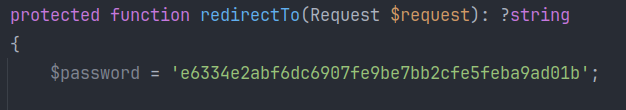
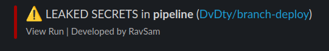
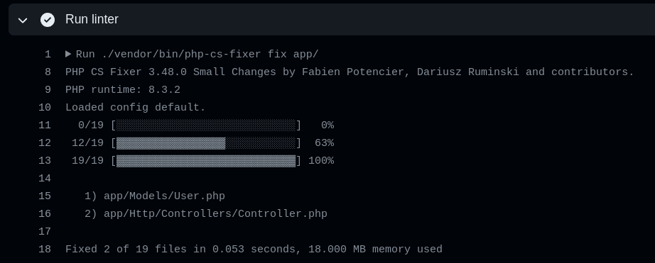
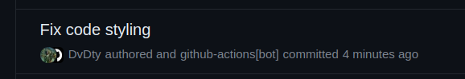
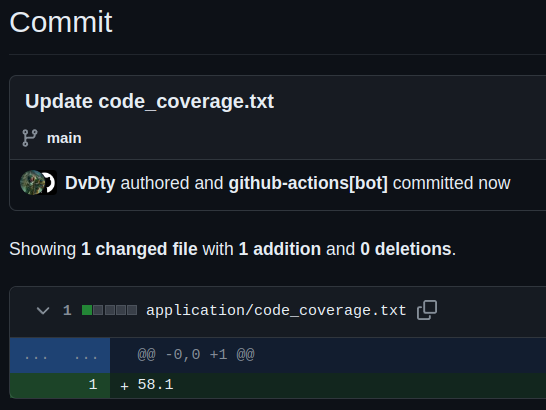
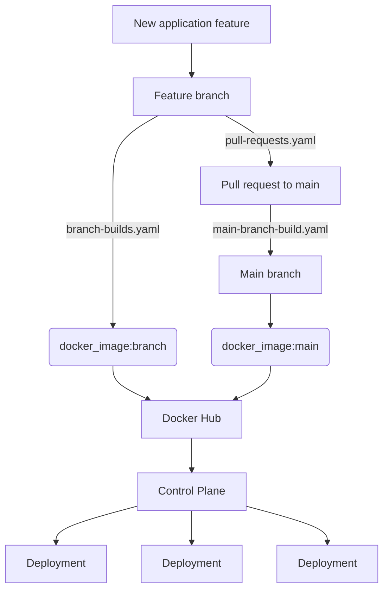

# Branch deploy

This repository holds two code bases:
 - Application, developed by a software team
 - Control plane, that allows easy deployments of the application

## Application

Main focus is to provide the development team strong CI:
 - Secure
 - Flexible
 - Highly automated
 - Fast

|                                                                                                                            | Push to main | Push on other branches | Pull requests |
|----------------------------------------------------------------------------------------------------------------------------|--------------|------------------------|---------------|
| [Gitleaks](https://github.com/DvDty/branch-deploy/blob/main/.github/workflows/main-branch-build.yaml#L8-L26)               |       ✅      |            ✅           |       ✅       |
| [Code linter](https://github.com/DvDty/branch-deploy/blob/main/.github/workflows/main-branch-build.yaml#L28-L64)           |              |                        |       ✅       |
| Build docker image                                                                                                         |       ✅      |            ✅           |       ✅       |
| Push image to Docker Hub                                                                                                   |       ✅      |            ✅           |               |
| Scan image before pushing                                                                                                  |       ✅      |                        |       ✅       |
| Unit tests                                                                                                                 |       ✅      |                        |       ✅       |
| Feature tests                                                                                                              |       ✅      |                        |       ✅       |
| Static code analysis                                                                                                       |       ✅      |                        |       ✅       |
| Sonar Cloud analysis                                                                                                       |       ✅      |                        |       ✅       |
| Database migrations                                                                                                        |       ✅      |                        |       ✅       |
| [Check code coverage](https://github.com/DvDty/branch-deploy/blob/main/.github/workflows/main-branch-build.yaml#L198-L210) |       ✅      |                        |       ✅       |
| [Store code coverage report](https://github.com/DvDty/branch-deploy/blob/main/.github/workflows/main-branch-build.yaml#L198-L210)                                                                                             |       ✅      |                        |               |
| Deploy to minikube                                                                                                         |       ✅      |                        |       ✅       |

### Gitleaks

Example with leaked api key:

Notification in slack:

### Code linter

### Code coverage

## Control plane

The control plane allow us to easily create instances of our application on demand through a user-friendly interface. The software development life cycle looks like this:

